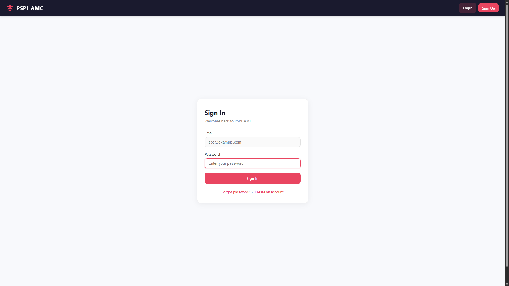
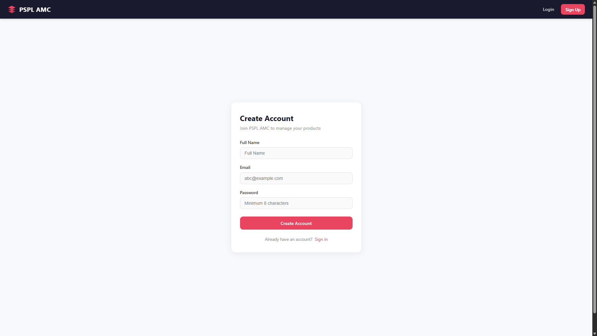
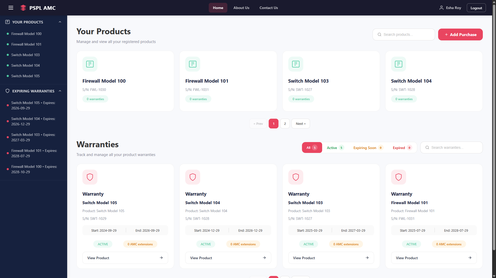
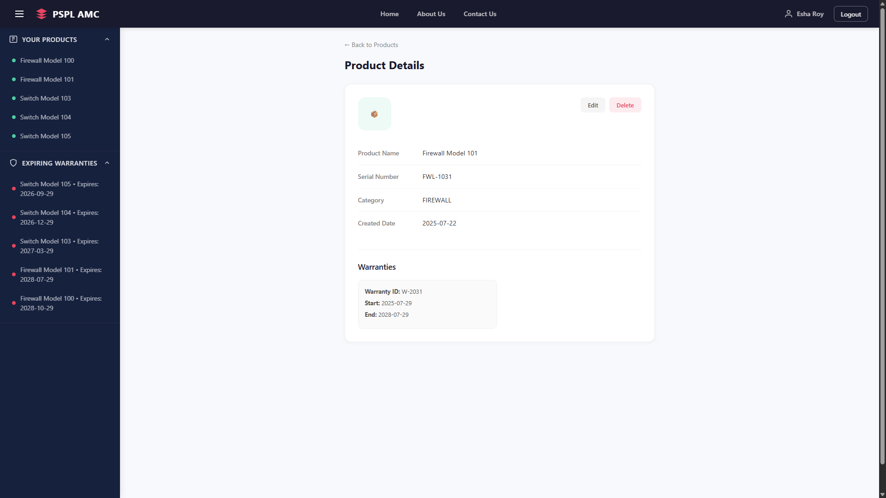
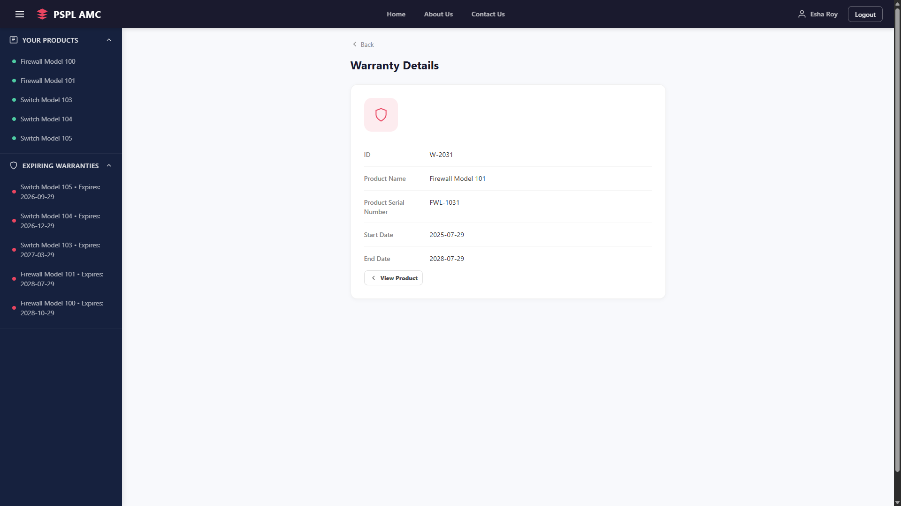
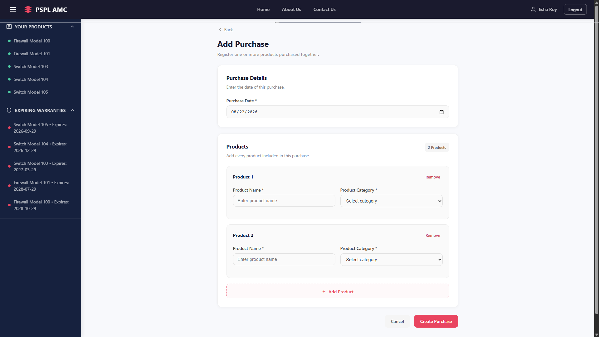

# 🚀 PSPL — Post-Sale Product Lifecycle & AMC Management System

> A full-stack application for managing the **post-sale lifecycle of products** — from customer purchase and product registration through warranty coverage and successive Annual Maintenance Contracts (AMCs).
>
> Built with **Spring Boot, Angular, and CognoDB (Neo4j-compatible graph database)**.

---

## 📌 Table of Contents

* [Overview](#-overview)
* [Use Case](#-use-case)
* [Why a Graph Database?](#-why-a-graph-database)
* [Core Graph Model](#-core-graph-model)
* [Key Features](#-key-features)
* [Tech Stack](#-tech-stack)
* [Architecture](#-architecture)
* [Important Graph Queries](#-important-graph-queries)
* [Seed Data](#-seed-data)
* [Setup Instructions](#-setup-instructions)
* [Running the Application](#-running-the-application)
* [Screenshots](#-screenshots)
* [Future Scope](#-future-scope)

---

# 🧩 Overview

**PSPL — Post-Sale Product Lifecycle & AMC Management System** is a full-stack application designed to track what happens to a product **after it has been sold**.

The system models the complete lifecycle:

```text
Customer
   ↓
Purchase / Sale
   ↓
Product
   ↓
Warranty
   ↓
AMC
   ↓
AMC Offer
```

The important aspect of the project is that these are not isolated records. They form an interconnected graph.

A customer can make multiple purchases, each sale can contain multiple products, products can have warranty coverage, and a warranty can subsequently be extended through multiple AMCs over time.

The application provides a user-facing Angular interface for authentication, product management, warranty monitoring and product lifecycle operations, backed by a Spring Boot REST API and a CognoDB graph database.

The underlying domain is intentionally designed to demonstrate where **relationship-oriented data modelling and graph traversal** provide value.

---

# 🎯 Use Case

### The problem

Traditional post-sale systems often treat information such as:

* customers
* purchases
* products
* warranties
* maintenance contracts
* contract offers

as separate entities.

The difficult part isn't storing each record — it is answering questions about **how those records are connected**.

For example:

> Which products belong to this customer?

```text
Customer
   ↓ PURCHASED
Sale
   ↓ OF_PRODUCT
Product
```

Or:

> What coverage does this customer's product currently have?

```text
Customer
   ↓
Sale
   ↓
Product
   ↓
Warranty
   ↓
AMC
   ↓
AMCOffer
```

PSPL models these connections directly so that lifecycle-related questions can be answered through graph traversal.

### Example business scenarios

**Customer purchase history**

```text
Customer → Sales → Products
```

**Product coverage**

```text
Product → Warranty
```

**Post-warranty maintenance**

```text
Product → Warranty → AMC
```

**AMC plan identification**

```text
Product → Warranty → AMC → AMCOffer
```

**Customer's complete product lifecycle**

```text
Customer
   ↓
Purchase
   ↓
Product
   ↓
Warranty
   ↓
AMC 1
   ↓
AMC 2
   ↓
AMC 3
```

This last scenario is particularly important because the model supports **multiple successive AMCs for a single warranty**, allowing the lifecycle to continue beyond the original warranty period.

---

# 🕸️ Why a Graph Database?

## Why CognoDB / Graph?

The central characteristic of this application is **relationships**.

The primary business questions are often traversal questions:

> "Starting from this customer, what products did they purchase and what coverage do those products currently have?"

That naturally translates into:

```text
Customer
   ↓
Sale
   ↓
Product
   ↓
Warranty
   ↓
AMC
   ↓
AMCOffer
```

In a graph database, these relationships are first-class elements of the data model.

CognoDB provides a Neo4j-compatible graph database environment, allowing the application to use nodes, relationships and Cypher queries.

---

## Why not PostgreSQL/MySQL?

A relational database could absolutely store this application.

For example, a relational implementation might require tables such as:

```text
users
customers
sales
products
warranties
amcs
amc_offers
```

with foreign keys connecting them.

A query spanning the entire lifecycle would then require several joins:

```text
Customer
   JOIN Sale
      JOIN Product
         JOIN Warranty
            JOIN AMC
               JOIN AMCOffer
```

That isn't inherently wrong.

The difference is that the **graph representation makes the domain relationships explicit and directly traversable**.

### Relational model

```text
Customer
   │
   ├── customer_id
   │
   ▼
Sale
   │
   ├── customer_id
   └── ...
```

Connections are primarily represented through foreign-key columns.

### Graph model

```text
(Customer)
     │
     │ PURCHASED
     ▼
   (Sale)
     │
     │ OF_PRODUCT
     ▼
 (Product)
     │
     │ HAS_WARRANTY
     ▼
(Warranty)
     │
     │ EXTENDED_BY
     ▼
   (AMC)
     │
     │ BASED_ON
     ▼
(AMCOffer)
```

The graph therefore makes the **business topology itself part of the database model**.

This is particularly useful when the application needs to:

* traverse multiple levels of relationships;
* find related entities;
* follow a customer's complete lifecycle;
* determine what coverage is associated with a product;
* identify maintenance contracts connected to warranties;
* expand the domain with additional connected entities in the future.

The project's database documentation defines these relationships as outgoing graph relationships with no relationship properties.

---

# 🧠 Core Graph Model

The primary business graph is:

```text
(User)
   │
   │ IS_CUSTOMER
   ▼
(Customer)
   │
   │ PURCHASED
   ▼
(Sale)
   │
   │ OF_PRODUCT
   ▼
(Product)
   │
   │ HAS_WARRANTY
   ▼
(Warranty)
   │
   │ EXTENDED_BY
   ▼
(AMC)
   │
   │ BASED_ON
   ▼
(AMCOffer)
```

### Relationship semantics

| From       | Relationship   | To         | Meaning                                        |
| ---------- | -------------- | ---------- | ---------------------------------------------- |
| `User`     | `IS_CUSTOMER`  | `Customer` | Authenticated account represents a customer    |
| `Customer` | `PURCHASED`    | `Sale`     | Customer made a purchase                       |
| `Sale`     | `OF_PRODUCT`   | `Product`  | Sale contains one or more products             |
| `Product`  | `HAS_WARRANTY` | `Warranty` | Product has warranty coverage                  |
| `Warranty` | `EXTENDED_BY`  | `AMC`      | Warranty lifecycle can continue through AMCs   |
| `AMC`      | `BASED_ON`     | `AMCOffer` | AMC is based on a particular maintenance offer |

The business graph supports one-to-many relationships such as:

```text
Customer ──▶ many Sales

Sale ──▶ many Products

Product ──▶ many Warranties

Warranty ──▶ many AMCs
```

The AMC chain is intentionally capable of representing successive maintenance contracts rather than only a single extension.

---

## Example Node Properties

### `User`

```text
id
name
email
password
createdAt
updatedAt
```

Authentication is session-based, while the business lifecycle is represented through the graph.

### `Customer`

```text
custId
custName
```

### `Sale`

```text
saleId
saleDate
```

### `Product`

```text
productSerialNumber
productName
productCreatedDate
productCategory
```

### `Warranty`

```text
warrantyId
warrantyStartDate
warrantyEndDate
```

### `AMC`

```text
amcId
amcStartDate
amcEndDate
```

### `AMCOffer`

```text
offerId
offerType
offerDurationMonths
offerPrice
offerTerms
```

---

# ✨ Key Features

### Authentication

* User signup
* Login/logout
* Session-based authentication
* Session restoration
* Password reset workflow
* BCrypt password hashing

### Product Management

* Product listing
* Product search
* Server-side pagination
* Product creation
* Product details
* Product editing
* Product deletion
* Automatic product serial generation
* Product categories

### Warranty Management

* Warranty creation
* Automatic warranty duration calculation
* Warranty listing
* Warranty expiry monitoring
* Product → Warranty graph traversal

### AMC Lifecycle

The graph supports:

```text
Warranty
   ↓
AMC 1
   ↓
AMC 2
   ↓
AMC 3
```

with each AMC connected to an `AMCOffer`.

### Seed Dataset

The repository includes deterministic seed data designed to create a meaningful interconnected graph rather than isolated test records.

The project documentation explicitly identifies the domain as Customer → Sale → Product → Warranty → AMC → AMC Offer.

---

# 🛠 Tech Stack

| Layer             | Technology                                |
| ----------------- | ----------------------------------------- |
| Frontend          | Angular 21                                |
| Language          | TypeScript                                |
| Backend           | Spring Boot 4                             |
| Language          | Java                                      |
| Database          | CognoDB / Neo4j-compatible graph database |
| Database Access   | Spring Data Neo4j                         |
| Query Language    | Cypher                                    |
| Authentication    | Spring Security + HTTP Session            |
| Password Security | BCrypt                                    |
| Build             | Maven + npm                               |
| UI State          | Angular Signals                           |

The application follows the Angular standalone/signal-based frontend approach and Spring Boot + Spring Data Neo4j backend architecture described in the project documentation.

---

# 🏗️ Architecture

```text
┌──────────────────────────────────────┐
│           Angular Frontend           │
│                                      │
│ Components                           │
│ Services                             │
│ Signals / UI State                   │
└─────────────────┬────────────────────┘
                  │
                  │ HTTP / REST
                  ▼
┌──────────────────────────────────────┐
│          Spring Boot Backend         │
│                                      │
│ Controllers                          │
│       ↓                              │
│ Services                             │
│       ↓                              │
│ Repositories                         │
└─────────────────┬────────────────────┘
                  │
                  │ Cypher
                  ▼
┌──────────────────────────────────────┐
│             CognoDB                  │
│          Graph Database              │
│                                      │
│ Nodes + Relationships                │
└──────────────────────────────────────┘
```

The backend follows a controller → service → repository flow, while the frontend communicates with the backend through HTTP services.

---

# 🔎 Important Graph Queries

The project doesn't use Cypher merely to store nodes. The important queries demonstrate **why the relationships exist**.

## 1. Find all products owned by a customer

```cypher
MATCH (c:Customer)-[:PURCHASED]->(s:Sale)-[:OF_PRODUCT]->(p:Product)
WHERE c.custId = $customerId
RETURN DISTINCT p
ORDER BY p.productName ASC
```

### Graph problem solved

Instead of querying a Product table and manually resolving ownership through foreign keys, the query follows:

```text
Customer
   ↓ PURCHASED
Sale
   ↓ OF_PRODUCT
Product
```

This directly answers:

> "Which products has this customer purchased?"

This traversal is currently used by the product-access flow.

---

## 2. Find a customer's specific product

```cypher
MATCH (c:Customer)-[:PURCHASED]->(s:Sale)-[:OF_PRODUCT]->(p:Product)
WHERE c.custId = $customerId
  AND p.productSerialNumber = $productSerialNumber
RETURN p
```

### Graph problem solved

This combines **ownership verification and product lookup** in one traversal:

```text
Customer
   ↓
Sale
   ↓
Product
```

It prevents the application from treating a product as belonging to a customer merely because its serial number exists.

---

## 3. Find warranties belonging to a product

```cypher
MATCH (p:Product)-[:HAS_WARRANTY]->(w:Warranty)
RETURN w
ORDER BY w.warrantyStartDate ASC
```

### Graph problem solved

The query follows the direct lifecycle relationship:

```text
Product → Warranty
```

This is useful for determining the coverage history of a product.

---

## 4. Find the complete post-sale lifecycle

The graph can be traversed across the entire domain:

```cypher
MATCH (c:Customer)-[:PURCHASED]->(s:Sale)
      -[:OF_PRODUCT]->(p:Product)
      -[:HAS_WARRANTY]->(w:Warranty)
      -[:EXTENDED_BY]->(a:AMC)
      -[:BASED_ON]->(o:AMCOffer)
WHERE c.custId = $customerId
RETURN c, s, p, w, a, o
```

### Graph problem solved

This is the core value proposition of the database.

One traversal can answer:

> "Show me the customer's purchase, the product, its warranty, every AMC extension, and the offer associated with each AMC."

The graph structure is explicitly designed around this chain.

---

# 🌱 Seed Data

The repository includes a dedicated seed-data mechanism.

The goal is to allow a fresh CognoDB instance to become usable without manually creating every node and relationship.

### Seed flow

```text
Create CognoDB instance
        ↓
Configure credentials
        ↓
Enable seed data
        ↓
Start backend
        ↓
Seed script creates graph
        ↓
Database populated
        ↓
Start frontend
        ↓
Use application
```

The seed dataset creates multiple users and interconnected business data rather than only isolated users/products.

The resulting graph demonstrates:

```text
User
 ↓
Customer
 ↓
Multiple Sales
 ↓
Multiple Products
 ↓
Warranty
 ↓
0..N AMCs
 ↓
AMC Offers
```

This is important because the graph queries should operate against realistic relationships rather than a collection of disconnected demo nodes.

---

# ⚙️ Setup Instructions

## 1. Create a CognoDB account

Create an account with **CognoDB** and access the database/cloud console.

---

## 2. Create a CognoDB instance

Create a new database instance.

After the instance is provisioned, obtain its connection details.

You will need:

```text
Database URI
Username
Password
```

---

## 3. Obtain database credentials

Your application needs the CognoDB connection credentials used by Spring Data Neo4j.

Do **not** commit these credentials to GitHub.

---

## 4. Configure environment variables

Configure the following environment variables:

```text
NEO4J_URI
NEO4J_USERNAME
NEO4J_PASSWORD
```

Example on Windows PowerShell:

```powershell
$env:NEO4J_URI="your-cognodb-uri"
$env:NEO4J_USERNAME="your-username"
$env:NEO4J_PASSWORD="your-password"
```

Example:

```text
NEO4J_URI=bolt+s://your-instance...
NEO4J_USERNAME=...
NEO4J_PASSWORD=...
```

The application uses the Neo4j-compatible connection configuration provided to Spring Data Neo4j.

---

## 5. Enable seed data

The seed mechanism is controlled using:

```properties
app.seed-data=true
```

Set this in the backend configuration/environment for the initial database population.

The seed process is designed to avoid recreating the dataset when users already exist.

### Important

After the initial seed, you can disable it:

```properties
app.seed-data=false
```

This prevents accidental reseeding when starting the application normally.

---

## 6. Start the backend

From the backend project directory:

```bash
mvnw spring-boot:run
```

On Windows:

```powershell
.\mvnw.cmd spring-boot:run
```

The Spring Boot application runs on:

```text
http://localhost:8080
```

---

## 7. Start the frontend

Open another terminal and navigate to the Angular application:

```bash
npm install
```

Then:

```bash
npm start
```

The Angular development server runs on:

```text
http://localhost:4200
```

---

## 8. Access the application

Open:

```text
http://localhost:4200
```

You can then:

1. Log in using a seeded user.
2. Browse products.
3. View product details.
4. View warranty information.
5. Create/update/delete products.
6. Explore the connected post-sale lifecycle through the application/API.

---

# 🔐 Seed Credentials

The development seed dataset uses a common demo password for seeded accounts:

```text
Password123!
```

The password is stored as a BCrypt hash rather than plaintext in the database.

**Use these credentials only for local/demo development.**

---

# 📸 Screenshots

> Replace the placeholders below with screenshots from the running application.

## Login

<!-- SCREENSHOT: Login Page -->



---

## Sign Up

<!-- SCREENSHOT: Signup Page -->



---

## Dashboard / Home

<!-- SCREENSHOT: Home Page -->



---

## Product Details

<!-- SCREENSHOT: Product Details -->



---

## Warranty Details

<!-- SCREENSHOT: Warranty Details -->



---

## Create Purchase

<!-- SCREENSHOT: Purchase Creation -->



---

# 🚀 Future Scope

The current system establishes the core post-sale graph. The architecture can be extended to support additional lifecycle operations.

Potential extensions include:

### AMC Management UI

Expose the existing AMC domain through dedicated UI screens:

```text
Warranty
   ↓
AMC
   ↓
AMC Offer
```

### Service / Maintenance History

Add:

```text
Product
   ↓
ServiceRequest
   ↓
Technician
```

This would allow the graph to answer questions such as:

> Which service requests were raised for this product?

---

### Customer 360 View

A dedicated customer view could traverse:

```text
Customer
 ├── Sales
 │    └── Products
 │         └── Warranties
 │              └── AMCs
 │                   └── Offers
 └── Service History
```

This would turn the graph into a complete **customer/product lifecycle view**.

---

### Warranty & AMC Notifications

The system could proactively identify:

* warranties approaching expiry;
* AMCs approaching expiry;
* products without active coverage;
* customers requiring renewal.

---

### Graph Analytics

The graph can eventually support analytics such as:

```text
Customers with expiring warranties
        ↓
Products requiring renewal
        ↓
Recommended AMC offers
```

This provides a foundation for turning PSPL from a CRUD application into a more relationship-aware **post-sale lifecycle platform**.

---

# 📁 Project Documentation

The repository also contains detailed documentation covering the project's architecture, feature inventory, API design, database model, user flows, architecture audit, rebuild blueprint and coding standards.

---

## 📄 Project Summary

**PSPL is a graph-driven post-sale lifecycle management system that models the complete journey of a purchased product — from customer and sale to warranty and successive AMC coverage — using Spring Boot, Angular and CognoDB.**

The core idea is simple:

```text
Don't just store the entities.

Store the relationships between them.
```

And then use those relationships to answer lifecycle questions through **graph traversal**.
